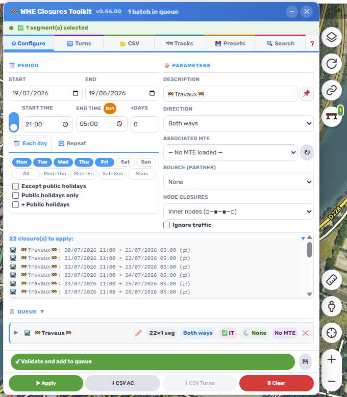

# WME Closures Toolkit

A userscript for the [Waze Map Editor](https://www.waze.com/editor) that turns road closure
management into a bulk operation: import a route, review it, queue it, apply it.

Built for editors handling real-world events — races, rallies, marathons, roadworks — where
dozens or hundreds of segments have to be closed on a recurring schedule.

## Features

- **Recurring closures with a queue** — build up a batch, review it, apply it in one pass.
- **Segment *and* turn closures** — including the geometry helpers needed to target turns reliably.
- **Route import** — GPX, KML, KMZ, GeoJSON and shapefiles (with reprojection).
- **Search** — find existing closures across segments and turns, filter by partner.
- **CSV export** — separate exports for segment closures and turn closures.
- **Partner source** — record and display which partner a closure originates from.
- **Major Traffic Event (MTE)** support.
- **Public holidays** taken into account when scheduling recurrences.
- **Seven languages**: English, French, German, Spanish, Portuguese (PT and BR), and Hebrew — with full right-to-left (RTL) layout.

## Installation

1. Install a userscript manager — [Tampermonkey](https://www.tampermonkey.net/) is recommended.
2. Install the script from **[GreasyFork](https://greasyfork.org/scripts/581015)**.
3. Open the Waze Map Editor. The toolkit appears in the sidebar.

Updates are delivered automatically through GreasyFork.

## Support

- Questions and discussion: **[Waze forum thread](https://www.waze.com/discuss/t/script-wme-closures-toolkit/405542)**
- Bug reports: **[open an issue](../../issues)**

When reporting a bug, please include your script version, your browser, and the steps to
reproduce it.

## Contributing

The script is a single self-contained file, `WME_ClosuresToolkit.user.js`. To try out a
change, point your userscript manager at your local copy instead of the GreasyFork one.

Bug reports and reproducible test cases are the most useful contributions.

## Credits

Inspired by *WME Advanced Closures* and [waze.tech-informatique.fr](https://waze.tech-informatique.fr).

## License

[MIT](LICENSE) © DrSlump34
