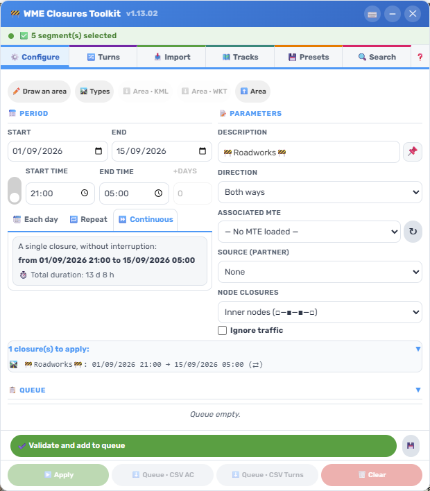
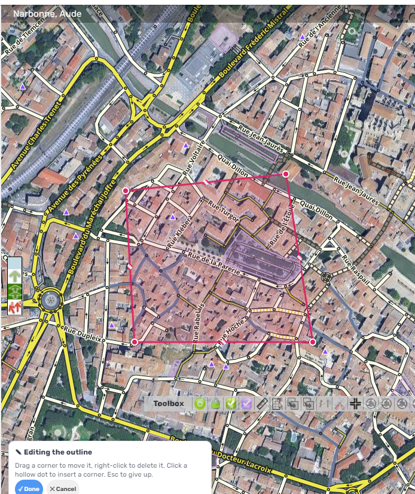
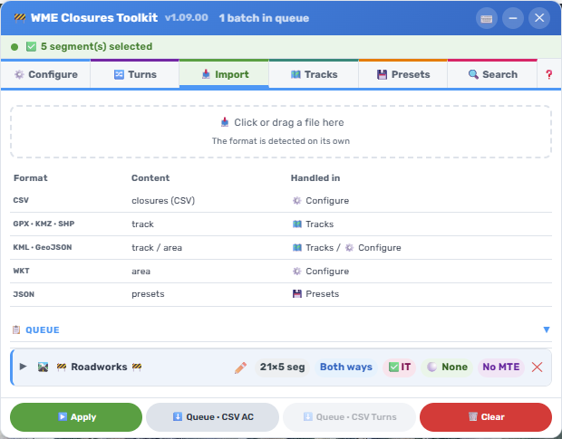

# WME Closures Toolkit

A userscript for the [Waze Map Editor](https://www.waze.com/editor) that turns road closure
management into a bulk operation: import a route, review it, queue it, apply it.

Built for editors handling real-world events — races, rallies, marathons, roadworks — where
dozens or hundreds of segments have to be closed on a recurring schedule.

Draw an area and it stays on the map. Pick it back up whenever you like: drag a corner,
right-click one to delete it, click a hollow dot to insert one.

Drop any file into the Import tab — the content decides where it goes:

## Features

- **Recurring closures with a queue** — build up a batch, review it, apply it in one pass.
- **Three ways to lay out time, one queue for all of them** — *Each day* for a weekly pattern,
  *Repeat* for N occurrences at a fixed interval, and *Continuous* for the simplest case of all:
  one closure running without interruption from a start date and time to an end date and time.
  A single event usually needs several of these at once — they all land in the same queue.
- **You can see what the run is doing, and what it did** — while applying, each queue batch
  carries its own state on its header (running · applied · partial · failed); a batch never
  reached stays unmarked. The line-by-line detail waits for the end, in a summary that stays
  folded when everything went through and opens itself when something did not.
- **Draw an area, then keep working on it** — outline a neighbourhood and it stays on the map as
  a layer. Double-click it to pick it back up: drag a corner to move it, right-click to delete
  one, click a hollow dot to insert one. Only once you accept the outline does WCT ask whether to
  select the segments inside — answer *no* and the area still lives on, ready to export.
  An imported KML or WKT area lands at exactly the same point as a freshly drawn one.
- **Every segment more than half inside is selected** — the survey does not depend on zoom, so
  nothing is missed on a large area. Road types are filterable after the fact, without redrawing,
  and the area itself exports to KML / WKT and reads back in.
- **One import tab for everything** — drop any file and WCT recognises it, handles it, and takes
  you where the next step happens: closure CSV, GPX, KML, KMZ, GeoJSON, shapefile, a `POLYGON(…)`
  WKT, or your own presets. Content decides, not the file extension.
- **Settings that survive** — presets and preferences live in the script manager's storage, not in
  the site's `localStorage`: clearing your browsing data no longer wipes them. Export, import, or
  load them from a URL to share presets with other editors.
- **Segment *and* turn closures** — including the geometry helpers needed to target turns reliably.
- **Route import** — GPX, KML, KMZ, GeoJSON and shapefiles (with reprojection).
- **Search** — find existing closures across segments and turns, filter by partner.
- **CSV export** — separate exports for segment closures and turn closures.
- **Partner source** — record and display which partner a closure originates from.
- **Major Traffic Event (MTE)** support.
- **Public holidays** taken into account when scheduling recurrences.
- **Eight languages**: English, French, German, Spanish, Italian, Portuguese (PT and BR), and Hebrew — with full right-to-left (RTL) layout for Hebrew.

## Installation

1. Install a userscript manager — [Tampermonkey](https://www.tampermonkey.net/) is recommended.
2. Install the script from **[GreasyFork](https://greasyfork.org/scripts/581015)**.
3. Open the Waze Map Editor. The toolkit appears in the sidebar.

Updates are delivered automatically through GreasyFork.

## Support

- Questions and discussion: **[Waze forum thread](https://www.waze.com/discuss/t/script-wme-closures-toolkit/405542)**
- Bug reports: **[open an issue](../../issues)**

When reporting a bug, please include your script version, your browser, and the steps to
reproduce it.

## Contributing

The script is a single self-contained file, `WME_ClosuresToolkit.user.js`. To try out a
change, point your userscript manager at your local copy instead of the GreasyFork one.

Bug reports and reproducible test cases are the most useful contributions.

## Credits

*WME Advanced Closures* by dummyd2, seb-d59 and WazeDev — the foundation that made this possible.
*CSV Helper* by InstantT — [waze.tech-informatique.fr](https://waze.tech-informatique.fr).

## License

[MIT](LICENSE) © DrSlump34
