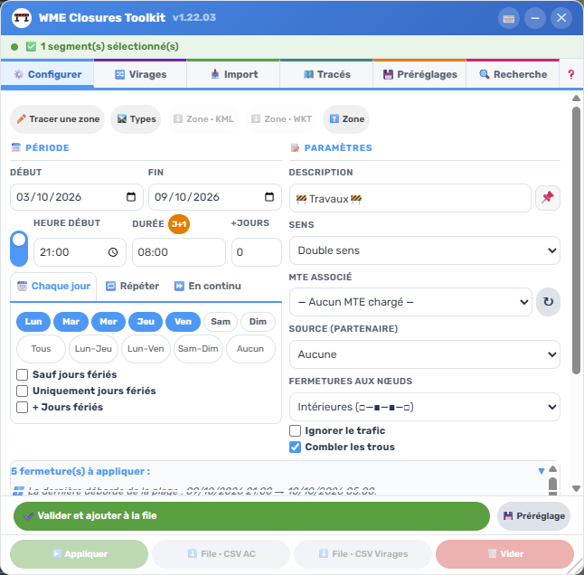
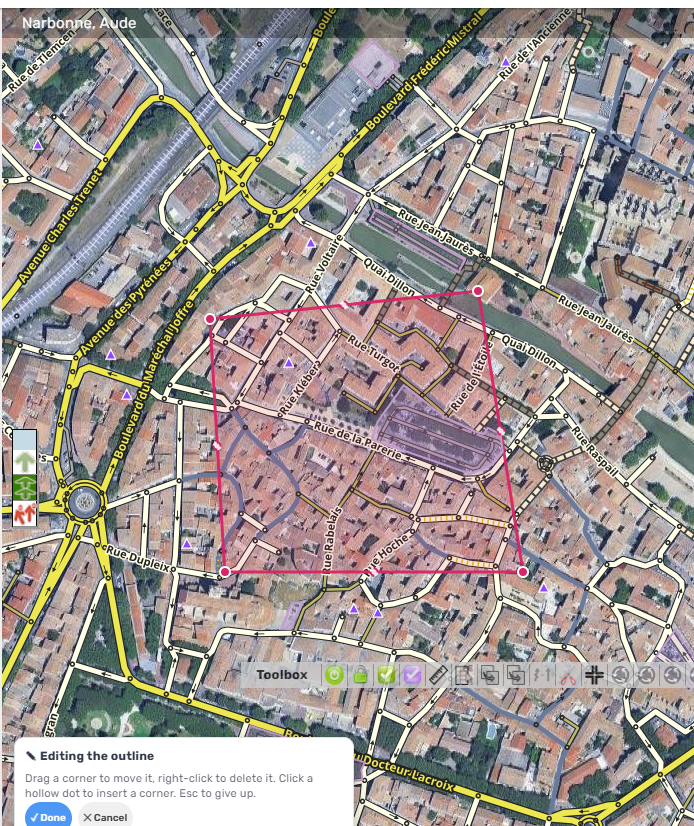

# WME Closures Toolkit

A userscript for the [Waze Map Editor](https://www.waze.com/editor) that turns road closure
management into a bulk operation: import a route, review it, queue it, apply it.

Built for editors handling real-world events — races, rallies, marathons, roadworks — where
dozens or hundreds of segments have to be closed on a recurring schedule.

Draw an area and it stays on the map. Pick it back up whenever you like: drag a corner,
right-click one to delete it, click a hollow dot to insert one.

Drop any file into the Import tab — the content decides where it goes. A closure CSV asks
whether to select its segments or to queue its rows as they are; when the rows carry different
dates, queuing them is the main choice:

## Features

- **Recurring closures with a queue** — build up a batch, review it, apply it in one pass.
- **Three ways to lay out time, one queue for all of them** — *Each day* for a weekly pattern,
  *Repeat* for N occurrences at a fixed interval, and *Continuous* for the simplest case of all:
  one closure running without interruption from a start date and time to an end date and time.
  A single event usually needs several of these at once — they all land in the same queue.
- **Checked before anything is written** — segments already closed at that time, or with no
  direction open to traffic, are skipped and reported instead of being sent; two closures that
  meet end to end (08:00 / 08:00) are caught too, since Waze rejects them. If Waze still refuses a
  batch, WCT splits it until only the faulty segment is left out — named in the summary.
- **Fill the gaps** — when a segment is already partly closed during the requested time, WCT only
  adds the missing pieces, before, between or after the existing closures, one minute apart, and
  never touches them — whether they belong to another editor or to a partner. On by default.
- **Import a closure CSV as a selection** — instead of queueing a file as it is, WCT can select
  its segments on the map, so you set the closure yourself — MTE picked from the list included.
- **You can see what the run is doing, and what it did** — while applying, each queue batch
  carries its own state on its header (running · applied · partial · failed); a batch never
  reached stays unmarked. The line-by-line detail waits for the end, in a summary that stays
  folded when everything went through and opens itself when something did not.
- **Draw an area, then keep working on it** — outline a neighbourhood and it stays on the map as
  a layer. Double-click it to pick it back up: drag a corner to move it, right-click to delete
  one, click a hollow dot to insert one. Only once you accept the outline does WCT ask whether to
  select the segments inside — answer *no* and the area still lives on, ready to export.
  An imported KML, GeoJSON or WKT area lands at exactly the same point as a freshly drawn one.
- **Every segment more than half inside is selected** — the survey does not depend on zoom, so
  nothing is missed on a large area. Road types are filterable after the fact, without redrawing,
  and the area itself exports to KML / WKT and reads back in.
- **One import tab for everything** — drop any file and WCT recognises it, handles it, and takes
  you where the next step happens: closure CSV, GPX, KML, KMZ, GeoJSON, shapefile, a `POLYGON(…)`
  WKT, or your own presets. Content decides, not the file extension.
- **Settings that survive** — presets and preferences live in the script manager's storage, not in
  the site's `localStorage`: clearing your browsing data no longer wipes them. Export, import, or
  load them from a URL to share presets with other editors.
- **Segment *and* turn closures** — including the geometry helpers needed to target turns reliably.
- **Route import** — GPX, KML, KMZ, GeoJSON and shapefiles (with reprojection). Track names are
  read from the file's own attributes, tracks sharing a name share a colour, and a colour the file
  declares itself (`stroke`, the simplestyle convention) is honoured. Colour, thickness and opacity
  are adjustable per track, and the last values chosen become the default for later imports.
- **A window you can actually place** — drag it by its header, resize it by the bottom-right handle.
  Size and position are remembered between sessions and pulled back on screen when you switch
  machines; double-clicking the header restores automatic sizing.
- **Search** — find existing closures across segments and turns, filter by partner.
- **CSV export** — separate exports for segment closures and turn closures.
- **Recurring CSV rows (`add-rec`)** — one row describes a whole schedule: after the 11 Advanced
  Closures columns come *days* (`12345` = Monday to Friday), *hours* (`07:30-18:00`, a night
  `21:00-06:00`, or several ranges `08:00-12:00;13:30-17:30`), *holidays* (`skip`) and *country*
  (`FR`). WCT expands the row with the Configure engine into a single queue entry, and exporting
  the queue writes an untouched *Each day* entry back as one such row. Advanced Closures ignores
  `add-rec` rows instead of reading them as one continuous closure.
- **Partner source** — record and display which partner a closure originates from.
- **Major Traffic Event (MTE)** support.
- **Public holidays, down to the region** — a recurrence can skip them, target only them, or add
  them to the days you picked. In countries where holidays differ by state or territory, the region
  is worked out from where the segment is; you can always pick another one, or the whole country,
  and that choice is remembered.
- **Eight languages**: English, French, German, Spanish, Italian, Portuguese (PT and BR), and Hebrew — with full right-to-left (RTL) layout for Hebrew.

## Installation

1. Install a userscript manager — [Tampermonkey](https://www.tampermonkey.net/) is recommended.
2. Install the script from **[GreasyFork](https://greasyfork.org/scripts/581015)**.
3. Open the Waze Map Editor. The toolkit appears in the sidebar.

Updates are delivered automatically through GreasyFork.

## Support

- Questions and discussion: **[Waze forum thread](https://www.waze.com/discuss/t/script-wme-closures-toolkit/405542)**
- Bug reports: **[open an issue](../../issues)**

When reporting a bug, please include your script version, your browser, and the steps to
reproduce it.

## Contributing

The script is a single self-contained file, `WME_ClosuresToolkit.user.js`. To try out a
change, point your userscript manager at your local copy instead of the GreasyFork one.

Bug reports and reproducible test cases are the most useful contributions.

## Credits

*WME Advanced Closures* by dummyd2, seb-d59 and WazeDev — the foundation that made this possible.
*CSV Helper* by InstantT — [waze.tech-informatique.fr](https://waze.tech-informatique.fr).

## License

[MIT](LICENSE) © DrSlump34
